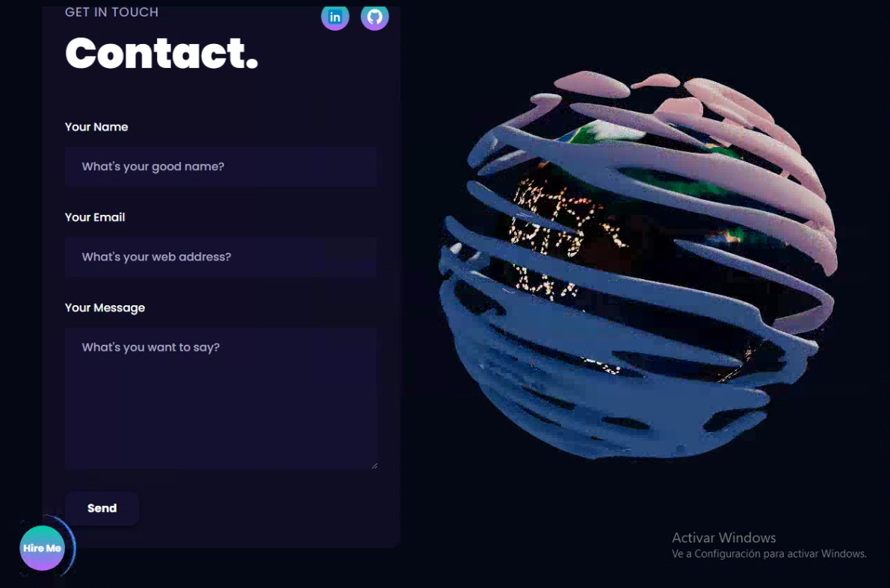

# Intro Site with Three.js and Framer

## 🚀 Technologies Used
- **Three.js**: The magic behind this project, a potent 3D graphics library.
- **React Three Fiber**: Seamlessly integrate Three.js into React with this popular library.
- **Tailwind CSS**: Elevate your design game with this utility-first CSS framework.
- **Framer Motion**: Bring your website to life with captivating animations.

## 🛠️ Usage
You can easily create your own 3-D portfolio website using this project as a template. Just follow these steps:
1. Clone this repository.
2. Navigate to the project directory.
3. Run `npm install` to install dependencies.
4. Modify the data in `src/constants/index.js` with your own content.
5. Run `npm start` to start the development server.
